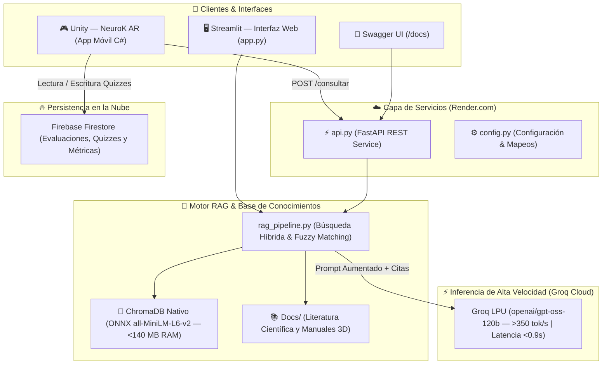

# 🧠 Atena — Consultor RAG de Neuroanatomía

Sistema de Inteligencia Artificial que actúa como **consultor científico especializado en neuroanatomía**. Diseñado para responder consultas académicas y clínicas basándose **exclusivamente** en literatura científica indexada, implementando una arquitectura **RAG (Retrieval-Augmented Generation)** de ultra-alto rendimiento conectada con **Groq Cloud LPU** y expuesta mediante una **API REST en FastAPI** para su integración en tiempo real con aplicaciones de Realidad Aumentada (**Unity — NeuroK AR**) y plataformas web.

---

## 📌 Descripción General

**Atena** procesa textos académicos y libros de referencia en neuroanatomía (formato PDF y DOCX), los fragmenta e indexa vectorialmente mediante **ChromaDB con ONNX Runtime** (`all-MiniLM-L6-v2`). Ante las consultas de estudiantes, docentes e investigadores, el sistema aplica **Búsqueda Híbrida** y **Fuzzy Matching** (tolerancia a errores tipográficos frecuentes en pantallas táctiles) para recuperar la evidencia más relevante, inyectándola como contexto estricto a un procesador de lenguaje de última generación (**Groq LPU — `openai/gpt-oss-120b`**).

El sistema garantiza respuestas de latencia sub-segundo (< 0.9s), cero alucinaciones y citas bibliográficas exactas por documento y página.

### Características Principales
- **Velocidad Extrema (Inferencia LPU):** Generación a más de **350 tokens/segundo** gracias al hardware determinista LPU de Groq.
- **Cero Alucinaciones:** Respuestas fundamentadas únicamente en el corpus científico indexado con directiva de abstención si la información no está en los textos.
- **Trazabilidad Académica Rigurosa:** Cada afirmación anatómica se referencia con el formato explícito `[Fuente X, pág. Y]`.
- **Tolerancia a Errores Léxicos (Fuzzy Matching):** Corrección automática de términos neuroanatómicos mal digitados (`hipicampo` $\rightarrow$ `hipocampo`).
- **Optimización Radical de Memoria (ONNX Runtime):** Consumo de RAM en servidor < 140 MB (ahorro del 73% frente a PyTorch), garantizando operación 24/7 estable en el plan gratuito de Render (límite 512 MiB).
- **Doble Nivel Pedagógico:** Respuestas calibradas para nivel **Básico** (estudiantes iniciales/visitantes) y **Avanzado** (estudiantes de psicología, medicina e investigadores).
- **API REST Multiplataforma:** Endpoints listos para ser consumidos desde **Unity (C#)**, móviles Android, web o herramientas analíticas.
- **Persistencia en la Nube:** Despliegue en **Render.com** sincronizado con GitHub y base de datos NoSQL en **Firebase Firestore** para evaluaciones y analítica.

---

## 🏛️ Arquitectura del Sistema



---

## 🌐 Servicios en la Nube (Producción)

| Servicio | URL / Acceso | Descripción |
|---|---|---|
| **API REST en Producción** | `https://atena-vugz.onrender.com` | Backend en la nube (Render.com Docker) |
| **Documentación Interactiva (Swagger)** | [https://atena-vugz.onrender.com/docs](https://atena-vugz.onrender.com/docs) | Pruebas interactivas de endpoints |
| **Health Check** | [https://atena-vugz.onrender.com/salud](https://atena-vugz.onrender.com/salud) | Estado de salud y verificación de base vectorial |
| **Base de Datos NoSQL** | Firebase Cloud Firestore (`atena-2d765`) | Métricas, evaluaciones de quizzes e historial |
| **Manual Técnico Completo** | [Otros/Manual_Tecnico_Atena_NeuroK.md](Otros/Manual_Tecnico_Atena_NeuroK.md) | Guía técnica detallada de infraestructura |
| **Informe Técnico y Justificación** | [Otros/Informe_Justificacion_Tecnica_Gemini_vs_Ollama.docx](Otros/Informe_Justificacion_Tecnica_Gemini_vs_Ollama.docx) | Comparativa empírica de hardware y arquitectura |

---

## 🚀 Endpoints de la API REST

### 1. `POST /consultar`
Recibe una consulta de neuroanatomía y devuelve la respuesta del consultor con fuentes bibliográficas y números de página.

**Request (JSON):**
```json
{
  "pregunta": "¿Cuáles son las funciones del hipocampo?",
  "nivel": "avanzado",
  "k": 5
}
```

**Response (JSON):**
```json
{
  "respuesta": "El hipocampo es una estructura fundamental del sistema límbico ubicada en el lóbulo temporal medial, esencial para la consolidación de la memoria a largo plazo y la navegación espacial [Neuroanatomia clinica 26va Edición - Lange.pdf, pág. 214]...",
  "fuentes": [
    {
      "fuente": "Neuroanatomia clinica  26va Edición - Lange.pdf",
      "pagina": 214,
      "fragmento": "El hipocampo forma parte del arquicórtex y desempeña un papel central en la consolidación de la memoria declarativa..."
    }
  ],
  "nivel": "avanzado"
}
```

### 2. `GET /salud`
Verifica la disponibilidad del servidor y comprueba el número de fragmentos indexados en ChromaDB:
```json
{
  "estado": "activo",
  "servicio": "Atena API REST",
  "version": "3.0.0",
  "documentos_indexados": 352
}
```

### 3. `GET /info`
Retorna información técnica sobre los modelos activos y capacidades del pipeline.

---

## 🎮 Integración con Unity (C#)

Para conectar la app móvil de Realidad Aumentada (**NeuroK AR**) con Atena, se utiliza el cliente en C#:

- **Archivo C#:** [`AtenaClient.cs`](AtenaClient.cs)
- **Uso en Unity:**
  ```csharp
  AtenaClient.Instance.ConsultarAsistente(
      "¿Qué es la sustancia negra?",
      "avanzado",
      (response) => {
          Debug.Log("Respuesta IA: " + response.respuesta);
          // Actualizar UI del Canvas en Unity
      },
      (error) => {
          Debug.LogError("Error de red: " + error);
      }
  );
  ```

---

## 🛠️ Ejecución Local (Desarrollo)

### Requisitos Previos
- Python 3.10 o 3.11
- Clave de API de Groq Cloud (`GROQ_API_KEY`) obtenida gratuitamente en [console.groq.com](https://console.groq.com)

### Instalación
```bash
# 1. Clonar el repositorio
git clone https://github.com/Vivi271/Atena.git
cd Atena

# 2. Crear y activar entorno virtual
python3 -m venv env
source env/bin/activate  # En Windows: env\Scripts\activate

# 3. Instalar dependencias
pip install -r requirements.txt

# 4. Configurar variables de entorno en .env
GROQ_API_KEY=gsk_tu_clave_de_groq_aqui
CHROMA_DB_DIR=chroma_neuro_db
SECRET_PIN=1234
```

### Iniciar Servicios Locales

- **Iniciar API REST (FastAPI):**
  ```bash
  python3 api.py
  # Disponible en http://localhost:8000/docs
  ```

- **Iniciar Interfaz Web (Streamlit):**
  ```bash
  streamlit run app.py
  # Disponible en http://localhost:8501
  ```

---

## 📚 Literatura Científica Indexada

1. **Neuroanatomía Clínica (26ª Edición)** — *Stephen G. Waxman (Lange / McGraw-Hill)*.
2. **El Cerebro y la Conducta: Neuroanatomía para Psicólogos** — *David L. Clark, Nash N. Boutros, Mario F. Mendez*.
3. **Manual de Modelo Neuroanatómico 3D** — *Laboratorio de Neurociencias Aplicadas (NeuroK)*.

---

## 📄 Licencia y Créditos

Proyecto desarrollado en el marco del trabajo de grado de la **Fundación Universitaria Konrad Lorenz** para el **Laboratorio de Neurociencias Aplicadas – NeuroK**.

- **Autores:** Viviana Marcela García Valderrama — Braian Felipe Ramirez Ortiz
- **Institución:** Fundación Universitaria Konrad Lorenz (2026)
