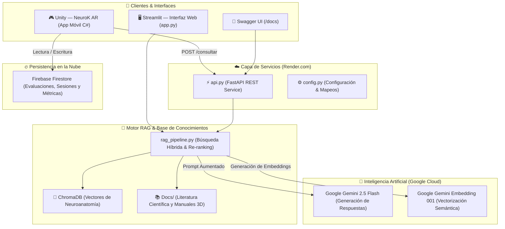

# 🧠 Atena — Consultor RAG de Neuroanatomía

Sistema de Inteligencia Artificial que actúa como **consultor científico especializado en neuroanatomía**. Diseñado para responder consultas académicas y clínicas basándose **exclusivamente** en literatura científica indexada, implementando una arquitectura **RAG (Retrieval-Augmented Generation)** conectada con **Google Gemini API** y expuesta mediante una **API REST en FastAPI** para su integración con aplicaciones de Realidad Aumentada (**Unity — NeuroK AR**) y plataformas web.

---

## 📌 Descripción General

**Atena** procesa textos académicos y libros de texto especializados en neuroanatomía (formato PDF y DOCX), los fragmenta e indexa vectorialmente en una base de datos (**ChromaDB**). Ante las consultas de estudiantes, docentes e investigadores, el sistema recupera la evidencia más relevante y la inyecta como contexto a un Modelo de Lenguaje de última generación (**Google Gemini 2.5 Flash**), garantizando respuestas precisas y citando explícitamente los documentos y páginas fuente.

### Características Principales
- **Cero Alucinaciones:** Respuestas fundamentadas únicamente en el corpus científico indexado.
- **Doble Nivel Pedagógico:** Respuestas adaptadas a nivel **Básico** (estudiantes iniciales/visitantes) y **Avanzado** (estudiantes de psicología, medicina y docentes).
- **API REST Multiplataforma:** Endpoints listos para ser consumidos desde **Unity (C#)**, aplicaciones móviles, web o sistemas externos.
- **Despliegue Continuo en la Nube:** Alojado en **Render.com** con integración directa desde GitHub y base de datos NoSQL en **Firebase Firestore**.
- **Trazabilidad Bibliográfica:** Cada respuesta incluye las citas exactas de los libros y manuales de referencia.

---

## 🏛️ Arquitectura del Sistema



---

## 🌐 Servicios en la Nube (Producción)

| Servicio | URL / Acceso | Descripción |
|---|---|---|
| **API REST en Producción** | `https://atena-vugz.onrender.com` | Backend en la nube (Render.com) |
| **Documentación Interactiva (Swagger)** | [https://atena-vugz.onrender.com/docs](https://atena-vugz.onrender.com/docs) | Pruebas interactivas de endpoints |
| **Health Check** | [https://atena-vugz.onrender.com/salud](https://atena-vugz.onrender.com/salud) | Estado de salud y verificación de base de datos |
| **Base de Datos NoSQL** | Firebase Cloud Firestore (`atena-2d765`) | Métricas, evaluaciones e historial |
| **Manual Técnico Completo** | [Otros/Manual_Tecnico_Atena_NeuroK.md](Otros/Manual_Tecnico_Atena_NeuroK.md) | Guía técnica detallada de infraestructura |

---

## 🚀 Endpoints de la API REST

### 1. `POST /consultar`
Recibe una consulta de neuroanatomía y devuelve la respuesta del asistente con fuentes citadas.

**Request (JSON):**
```json
{
  "pregunta": "¿Cuáles son las funciones del lóbulo frontal?",
  "nivel": "basico",
  "k": 6
}
```

**Response (JSON):**
```json
{
  "respuesta": "El lóbulo frontal es el encargado de las funciones ejecutivas, la planificación motora...",
  "fuentes": [
    {
      "fuente": "Neuroanatomia clinica  26va Edición - Lange.pdf",
      "pagina": 214,
      "fragmento": "El lóbulo frontal ocupa la porción anterior del hemisferio cerebral..."
    }
  ],
  "nivel": "basico"
}
```

### 2. `GET /salud`
Verifica la disponibilidad del servidor y si el vector store de neuroanatomía está cargado.

### 3. `GET /info`
Retorna información técnica sobre los modelos y capacidades del sistema.

---

## 🎮 Integración con Unity (C#)

Para conectar la app de Realidad Aumentada en Unity con Atena, utiliza el cliente oficial:

- **Archivo C#:** [`AtenaClient.cs`](AtenaClient.cs)
- **Uso en Unity:**
  ```csharp
  AtenaClient.Instance.ConsultarAsistente(
      "¿Qué es la sustancia negra?",
      "avanzado",
      (response) => {
          Debug.Log("Respuesta IA: " + response.respuesta);
      },
      (error) => {
          Debug.LogError("Error: " + error);
      }
  );
  ```

---

## 🛠️ Ejecución Local (Desarrollo)

### Requisitos Previos
- Python 3.10 o 3.11
- Clave de API de Google Gemini (`GEMINI_API_KEY`)

### Instalación
```bash
# 1. Clonar el repositorio
git clone https://github.com/Vivi271/Atena.git
cd Atena

# 2. Crear y activar entorno virtual
python3 -m venv env
source env/bin/activate  # En Windows: env\Scripts\activate

# 3. Instalar dependencias
pip install -r requirements.txt

# 4. Configurar variables de entorno
cp .env.example .env
# Añade tu clave en .env:
# GEMINI_API_KEY=tu_clave_aqui
```

### Iniciar Servicios Locales

- **Iniciar API REST (FastAPI):**
  ```bash
  python3 api.py
  # Disponible en http://localhost:8080/docs
  ```

- **Iniciar Interfaz Web (Streamlit):**
  ```bash
  streamlit run app.py
  # Disponible en http://localhost:8501
  ```

---

## 📚 Literatura Científica Indexada

1. **Neuroanatomía Clínica (26ª Edición)** — *Stephen G. Waxman (Lange / McGraw-Hill)*.
2. **El Cerebro y la Conducta: Neuroanatomía para Psicólogos** — *David L. Clark, Nash N. Boutros, Mario F. Mendez*.
3. **Manual de Modelo Neuroanatómico 3D** — *Laboratorio de Neurociencias Aplicadas (NeuroK)*.

---

## 📄 Licencia y Créditos

Proyecto desarrollado en el marco del trabajo de grado de la **Fundación Universitaria Konrad Lorenz** para el **Laboratorio de Neurociencias Aplicadas – NeuroK**.

- **Autora:** Viviana Marcela García Valderrama
- **Institución:** Fundación Universitaria Konrad Lorenz (2026)
