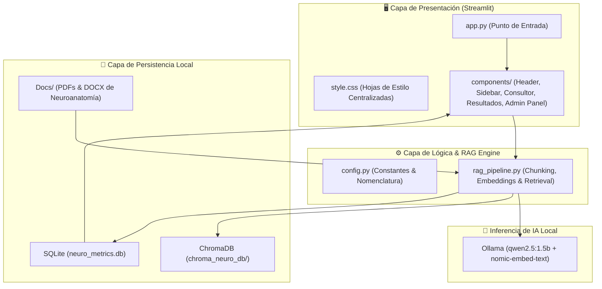

# Atena — Consultor RAG de Neuroanatomía

Sistema de Inteligencia Artificial que actúa como **consultor científico especializado en neuroanatomía**. Diseñado para responder consultas académicas y clínicas basándose **exclusivamente** en literatura científica indexada localmente, implementando una arquitectura **RAG (Retrieval-Augmented Generation)** de forma 100% local, soberana y privada.

---

## Descripción General

**Atena** procesa textos académicos y libros de texto especializados en formato PDF y DOCX, los fragmenta e indexa vectorialmente en una base de datos local (**ChromaDB**). Ante las consultas de estudiantes, docentes e investigadores en psicología y medicina, el sistema recupera la evidencia más relevante y la inyecta como contexto a un Modelo de Lenguaje Local (**Ollama - Qwen2.5 1.5B**), garantizando **cero alucinaciones** y citando explícitamente los documentos y páginas fuente.

### Soberanía Tecnológica y Privacidad
- **100% Local:** Ninguna consulta ni documento procesado viaja a servidores externos o APIs de terceros.
- **Sin Costos de Operación:** Funciona completamente offline tras descargar los modelos locales.
- **Trazabilidad y Evidencia:** Cada afirmación incluye las citas exactas de los libros y modelos indexados.

---

## Arquitectura del Sistema



---

## Estructura del Proyecto

```bash
Atena/
├── app.py                     # Aplicación principal Streamlit y orquestación
├── config.py                  # Variables globales, PIN de admin y utilidades
├── database.py                # Gestión de base de datos SQLite (telemetría e historial)
├── rag_pipeline.py            # Pipeline RAG (LangChain, ChromaDB y Ollama)
├── style.css                  # Hoja de estilos CSS institucional
├── requirements.txt           # Dependencias principales de Python
├── requirements_docker.txt    # Dependencias optimizadas para el entorno Docker
├── Dockerfile                 # Definición del contenedor de la aplicación
├── docker-compose.yml         # Orquestación de app + tunelización opcional
├── .gitignore                 # Exclusión de temporales, DBs y entornos virtuales
├── .dockerignore              # Exclusión de archivos para el build de Docker
├── .streamlit/
│   └── config.toml            # Configuración de tema y puertos de Streamlit
├── Docs/                      # Literatura científica indexable (PDF / DOCX)
│   ├── El cerebro y la conducta Neuroanatomía para psicólogos.pdf
│   ├── MODELO NEUROANATÓMICO 3D.docx
│   └── Neuroanatomia clinica  26va Edición - Lange.pdf
└── components/                # Módulos de la interfaz de usuario
    ├── __init__.py
    ├── admin_panel.py         # Panel de control del administrador y métricas
    ├── consultor.py           # Cuadro de entrada de consultas y sugerencias
    ├── header.py              # Encabezado institucional y branding
    ├── resultados.py          # Renderizado de respuestas y tarjetas de citas
    └── sidebar.py             # Control de nivel, carga de archivos y autenticación
```

---

## Especificación del Pipeline RAG

| Parámetro | Valor | Descripción |
|-----------|-------|-------------|
| **LLM Local** | `qwen2.5:1.5b` (Ollama) | Modelo de lenguaje optimizado de 1.5B parámetros (baja latencia y alta precisión). |
| **Embeddings** | `nomic-embed-text` | Modelo vectorial local de 768 dimensiones. |
| **Tamaño de Fragmento (chunk_size)** | 800 caracteres | Dimensión ideal para mantener contexto anatómico coherente. |
| **Solapamiento (chunk_overlap)** | 80 caracteres | Preserva la continuidad entre límites de fragmentos. |
| **Búsqueda Semántica** | Similitud de Coseno | Recuperación vectorial rápida y precisa en ChromaDB. |
| **Fragmentos Recuperados (k)** | 3 a 8 (Ajustable) | Inyección dinámica de evidencia documental al prompt del LLM. |
| **Temperatura de Inferencia** | 0.1 | Configuración determinista óptima para responder datos médicos precisos. |

---

## Instalación y Ejecución

### Prerrequisitos

1. **Python 3.10+** instalado.
2. **Ollama** instalado y corriendo en segundo plano ([ollama.com](https://ollama.com)).
3. Descargar los modelos requeridos en Ollama:
   ```bash
   ollama pull qwen2.5:1.5b
   ollama pull nomic-embed-text
   ```

---

### Opción 1: Ejecución Directa en Entorno Virtual (Recomendado)

```bash
# 1. Clonar el repositorio
git clone https://github.com/Vivi271/Atena.git
cd Atena

# 2. Crear y activar el entorno virtual
python3 -m venv env
source env/bin/activate        # En macOS / Linux
# env\Scripts\activate         # En Windows

# 3. Instalar dependencias de Python
pip install -r requirements.txt

# 4. Iniciar la aplicación Streamlit
streamlit run app.py
```
Accede desde tu navegador en `http://localhost:8502`.

---

### Opción 2: Ejecución mediante Docker Compose

```bash
# 1. Asegúrate de tener Docker Engine y Docker Compose instalados
docker-compose up --build -d
```
El contenedor se compilará e iniciará exponiendo el servicio en el puerto `8502`.

---

## Módulos Principales de la Aplicación

1. **Consultor de Aprendizaje:**
   - Selección de Nivel: **Básico** (explicaciones pedagógicas) o **Avanzado** (profundidad clínica y formal).
   - Detección de saludos y consultas fuera de dominio.
   - Previsualización expandible de fragmentos originales recuperados con número de página y nombre de fuente.

2. **Panel de Administración (PIN por defecto en `config.py`):**
   - **Gestión del Corpus:** Cargar nuevos artículos (PDF/DOCX) y eliminarlos del índice en tiempo real.
   - **Telemetría SQLite:** Gráficos de tiempo de respuesta (latencias en segundos), volumen de consultas y preferencia de niveles.
   - **Banco de Evaluaciones:** Crear, editar y eliminar preguntas de autoevaluación pedagógica.

3. **Base de Datos de Métricas (SQLite):**
   - Registra de forma transparente todas las consultas, respuestas, latencias y resultados de las evaluaciones tomadas por los usuarios en `chroma_neuro_db/neuro_metrics.db`.

---

## Créditos e Institución

Proyecto desarrollado en el marco del programa de Psicología / Neurociencia de la **Fundación Universitaria Konrad Lorenz**.
